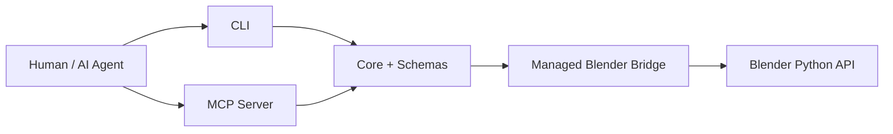

# BlendOps

[](https://nodejs.org/)
[](https://www.blender.org/)


Safe, inspectable Blender automation for AI agents via CLI + MCP + managed Blender bridge.

> 🛡️ **Security**: BlendOps exposes typed operations, not arbitrary Python execution.

## 🚀 Quick install

```bash
git clone https://github.com/ThanhNguyxnOrg/blendops.git
cd blendops
npm install
npm run build
```

## 🎛️ Start the managed Blender bridge

```bash
node apps/cli/dist/index.js bridge start --mode gui --verbose
node apps/cli/dist/index.js bridge status --verbose
node apps/cli/dist/index.js bridge operations --verbose
node apps/cli/dist/index.js scene inspect --verbose
```

Windows explicit Blender path:

```powershell
node apps/cli/dist/index.js bridge start --mode gui --blender "C:\Program Files\Blender Foundation\Blender 4.2\blender.exe" --verbose
```

## 🧰 CLI quick examples

> ✅ Keep stdout machine-parseable by using the built CLI directly.

```bash
node apps/cli/dist/index.js object create --type cube --name test_cube --location 0,0,1
node apps/cli/dist/index.js validate scene --preset basic
node apps/cli/dist/index.js render preview --output renders/preview.png
```

## 🧠 MCP quick setup

> 🧠 MCP server provides tool-calling access to the same typed BlendOps operations.

```bash
npm run build
node apps/mcp-server/dist/index.js
```

Generic MCP config:

```json
{
  "mcpServers": {
    "blendops": {
      "command": "node",
      "args": ["D:/Code/blendops/apps/mcp-server/dist/index.js"],
      "env": {
        "BLENDOPS_BRIDGE_URL": "http://127.0.0.1:8765"
      }
    }
  }
}
```

## 🧩 Usage surfaces

| Surface | Use when | Start here |
| --- | --- | --- |
| 🧰 CLI | Human/local scripting | `node apps/cli/dist/index.js ...` |
| 🧠 MCP / AI agents | Tool-calling from AI clients | `node apps/mcp-server/dist/index.js` |
| 🎛️ Managed Blender bridge | Automated Blender runtime | `bridge start --mode gui` |
| 🧩 Blender addon fallback | Manual Blender setup if bootstrap fails | Install/enable addon in Blender |

## ✅ What works today

| Area | Operations |
|---|---|
| Bridge | `bridge.start`, `bridge.status`, `bridge.operations`, `bridge.logs`, `bridge.stop` |
| History | `undo.last` |
| Scene | `scene.inspect`, `scene.clear` (requires `--confirm CLEAR_SCENE`) |
| Object | `object.create`, `object.transform` |
| Material | `material.create`, `material.apply` |
| Lighting | `lighting.setup` |
| Camera | `camera.set` |
| Render | `render.preview` |
| Validate | `validate.scene` |
| Export | `export.asset` |
| Batch | `batch.plan` (plan-only; does not execute) |

## ⚠️ Destructive operations

`scene.clear` removes all scene objects. Use it only when you explicitly intend to wipe scene contents, and always provide the exact confirmation token.

Preview what would be removed with `--dry-run`:

```bash
node apps/cli/dist/index.js scene clear --confirm CLEAR_SCENE --dry-run --verbose
```

Execute the actual clear:

```bash
node apps/cli/dist/index.js scene clear --confirm CLEAR_SCENE --verbose
```

## 🧭 Architecture



## 📚 Full documentation

| Need | Read |
|---|---|
| Install from scratch | [docs/install.md](./docs/install.md) |
| Use from AI/MCP | [docs/ai-agent-usage.md](./docs/ai-agent-usage.md) |
| Manual runtime checks | [docs/manual-test.md](./docs/manual-test.md) |
| Debug logs/status | [docs/observability.md](./docs/observability.md) |
| Eval prompts | [docs/evals.md](./docs/evals.md) |
| Runtime evidence | [docs/README.md#-runtime-evidence](./docs/README.md#-runtime-evidence) |

## ⚠️ Known limitations

- Blender 4.2 GLB/GLTF export requires GUI bridge mode.
- Background mode is limited/unvalidated for persistent bridge runtime.
- `undo.last` execution depends on Blender undo-stack/context availability; safe failure path is verified.
- No arbitrary Python execution endpoint is exposed by default.

## License

MIT — see [LICENSE](./LICENSE).
