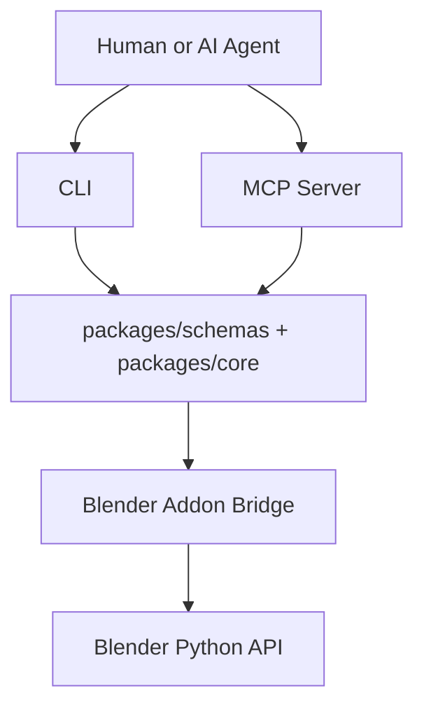

# BlendOps

<p align="left">
  =18" src="https://img.shields.io/badge/node-%3E%3D18-339933?logo=node.js&logoColor=white">
  =3.6" src="https://img.shields.io/badge/blender-%3E%3D3.6-F5792A?logo=blender&logoColor=white">
  
  
  
  
</p>

**Safe, inspectable Blender automation for AI agents via CLI + MCP + Blender bridge.**

BlendOps is a workflow layer for AI-assisted Blender work. It provides typed operations, structured JSON responses, and observability-first runtime behavior.

> 🛡️ **Security stance**: BlendOps does **not** expose arbitrary Python execution endpoints by default.

---

## 🚀 What BlendOps is

BlendOps combines three layers:

- 🧰 **CLI** for deterministic human and script workflows
- 🧠 **MCP server** for agent tool-calling
- 🎛️ **Blender addon bridge** for safe, structured operation execution

All three share the same typed schema/core contracts.

---

## ✅ Current capability matrix

| Area | Operation | CLI | MCP | Runtime evidence |
|---|---|---:|---:|---:|
| Bridge | `bridge.status` | ✅ | ✅ | ✅ |
| Bridge | `bridge.operations` | ✅ | ✅ | ✅ |
| Scene | `scene.inspect` | ✅ | ✅ | ✅ |
| Object | `object.create` | ✅ | ✅ | ✅ |
| Object | `object.transform` | ✅ | ✅ | ✅ |
| Material | `material.create` | ✅ | ✅ | ✅ |
| Material | `material.apply` | ✅ | ✅ | ✅ |
| Lighting | `lighting.setup` | ✅ | ✅ | ✅ |
| Camera | `camera.set` | ✅ | ✅ | ✅ |
| Render | `render.preview` | ✅ | ✅ | ✅ |
| Validate | `validate.scene` | ✅ | ✅ | ✅ |
| Export | `export.asset` | ✅ | ✅ | ✅ (GUI bridge GLB) |

---

## 🚀 Quickstart

```bash
git clone https://github.com/ThanhNguyxnOrg/blendops.git
cd blendops
npm install
npm run clean
npm run typecheck
npm run build

npm run cli -- bridge status --verbose
npm run cli -- bridge operations --verbose
npm run cli -- scene inspect --verbose
```

Then in Blender:

1. Open **Edit → Preferences → Add-ons → Install...**
2. Select `apps/blender-addon/blendops_addon`
3. Enable **BlendOps Bridge**
4. Confirm bridge on `http://127.0.0.1:8765`

---

## 🧭 Architecture



---

## 🛡️ Safety model

BlendOps adopts a constrained operation model:

- Typed operation contracts (Zod/JSON schema compatible)
- Operation manifest discovery (`bridge.operations`) for agent-safe introspection
- Structured response envelope (`ok`, `operation`, `message`, `data`, `warnings`, `next_steps`)
- No arbitrary Python execution tool by default
- Validation-first request handling
- Observable runtime behavior (CLI stderr + bridge console)

---

## 🎬 Example creative flow

```bash
npm run cli -- object create --type cube --name test_cube --location 0,0,1 --scale 1,1,1
npm run cli -- material create --name red_plastic --color "#ff0000" --roughness 0.5 --metallic 0
npm run cli -- material apply --object test_cube --material red_plastic
npm run cli -- lighting setup --preset studio --target test_cube
npm run cli -- camera set --target test_cube --distance 5 --focal-length 50
npm run cli -- render preview --output renders/preview.png --width 512 --height 512 --samples 16
npm run cli -- validate scene --preset game_asset
npm run cli -- export asset --format glb --output exports/test_scene.glb
```

---

## 🧪 Runtime evidence

- [Runtime smoke test (baseline)](./docs/runtime-smoke-test.md)
- [Runtime smoke test: object transform](./docs/runtime-smoke-test-object-transform.md)
- [Runtime smoke test: material](./docs/runtime-smoke-test-material.md)
- [Runtime smoke test: lighting](./docs/runtime-smoke-test-lighting.md)
- [Runtime smoke test: camera](./docs/runtime-smoke-test-camera.md)
- [Runtime smoke test: render](./docs/runtime-smoke-test-render.md)
- [Runtime smoke test: validate](./docs/runtime-smoke-test-validate.md)
- [Runtime smoke test: export](./docs/runtime-smoke-test-export.md)
- [Runtime smoke test: observability](./docs/runtime-smoke-test-observability.md)

---

## ⚠️ Known limitations

- Blender 4.2 background mode (`-b`) has glTF exporter window-context constraints for GLB/GLTF.
- BlendOps documents and guards this path:
  - GUI bridge mode is the validated path for GLB runtime smoke evidence.
  - Background GLB/GLTF is not treated as runtime PASS unless explicitly validated.

---

## 🧭 Roadmap (concise)

**Validated now**
- Core scene/object/material/lighting/camera/render/validate/export slices
- CLI + MCP parity for current operations
- Observability and runtime evidence workflow

**Next candidates**
- `undo.last`
- `scene.clear --confirm`
- Batch operations
- Validation preset expansion
- Packaging/release automation

---

## 📚 Documentation

- [Docs index](./docs/README.md)
- [Prior-art analysis](./docs/prior-art.md)
- [Manual test guide](./docs/manual-test.md)
- [Observability guide](./docs/observability.md)
- [Agent eval prompts](./docs/evals.md)
- [Project TODO / roadmap detail](./TODO.md)

---

## License

MIT — see [LICENSE](./LICENSE).
